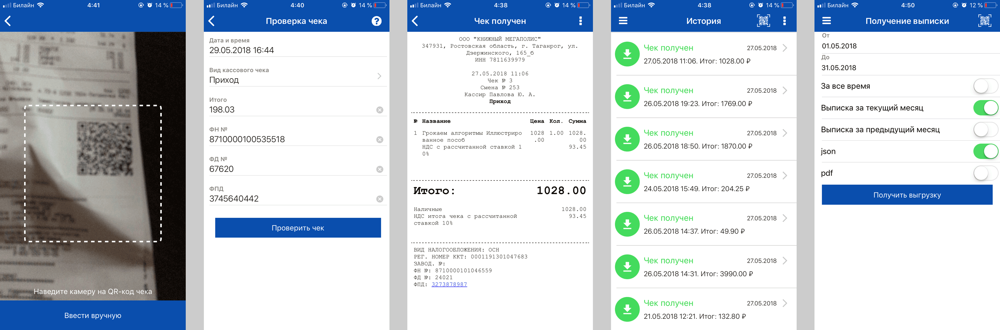

# Учет расходов по электронным чекам
Практически все магазины после покупки выдают чек с QR-кодом, который можно отсканировать приложением [Проверка чека](https://kkt-online.nalog.ru/) и получить в электронном виде список покупок. Приложение доступно на Андроиде и Айфоне.

Реализуйте веб-интерфейс, который позволит получать статистику по расходам на основе данных в формате JSON, экспортированных из этого приложения. Ваша задача — помочь пользователю разобраться, куда уходят его деньги.

Веб-интерфейс должен принимать JSON-файл, который можно перетащить на страницу или загрузить с помощь `<input type="file">`. Используйте тестовые данные из [`example.json`](example.json) или экспортируйте собственные данные из приложения.

Веб-интерфейс должен выводить затраты за тот период, которому соответствует JSON-файл. Предоставьте пользователю возможность сортировать информацию по цене и по названию товара.

Вы можете добавить собственные ништяки. Например, фильтрацию по названию магазина, поиск по товару и все, что посчитаете нужным.